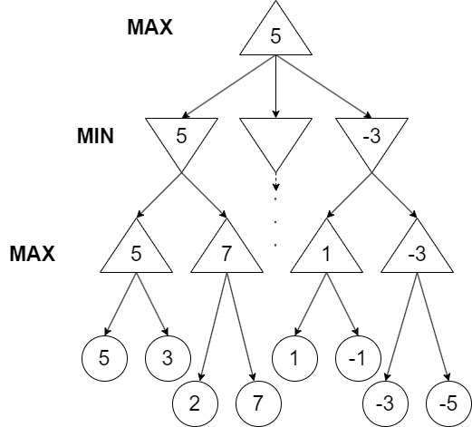

# Linja
Linja programado en Python. Linja es un juego de mesa de tipo adversario, donde un jugador juega contra otro.

## COMO JUGAR :question:
El tablero del linja está formado por 8 filas y 6 columnas. La distribución inicial del tablero es la siguiente:
 

 
Al igual que en cualquier juego de tipo adversario, los jugadores irán intercambiadnose el turno de forma secuencial. Cualquiera de los dos jugadores podrá comenzar la partida.

Cada turno está compuesto de 2 movimientos a excepción de algún caso que se explicará más adelante. En el primer movimiento, el jugador podrá desplazar cualquiera de sus fichas una posición hacia adelante, salvo que la fila que viene a continuación esté bloqueada por haber ya 6 fichas. En cualquier otro caso, tras haber realizado el primero movimiento, el jugador dispondrá de un segundo movimiento en el cual podrá desplazar una de sus piezas tantas posiciones como piezas hubiese en la fila a la que movió antes de iniciar el primer movimiento. Pongamos el siguiente ejemplo donde el jugador rojo avanza una de sus piezas una posición hacia delante.
 

 
En este caso, el jugador rojo podrá avanzar un total de 2 posiciones en su segundo movimiento

## :dart:SISTEMA DE PUNTUACIÓN
Como se ha visto en la primera imagen, el tablero está formado por 8 filas y está dividido en 2 zonas. Una de ellas es la zona de las piezas rojas, y otra es la zona de las piezas negras.

Cada fila tiene una puntuación determinada, siendo de forma simétrica para ambas partes del tablero. Para que una pieza del color negro puntúe, tiene que cruzar el centro del tablero y entrar en la zona de las piezas rojas, y viceversa.

## :straight_ruler:REGLAS/EXCEPCIONES:exclamation:
Este juego ha sufrido de bastantes cambios en las reglas de juego desde su creación. Sin embargo, esta versión del linja incluse las siguientes reglas o excepciones.
- Si en el primer movimiento el jugador mueve su pieza a una fila vacía, este jugador no tendrá derecho a realizar un segundo movimiento, y por tanto su turno habrá finalizado.
- Si en su segundo movimiento el jugador mueve una de sus piezas a una fila vacía, este será recompensado con un turno extra. Estas jugadas no son acumulables, dando lugar a un máximo de 4 movimientos por turno.
- Si un jugador desplaza en su primer movimiento una de sus piezas al extremo rival, solo podrá avanzar una fila en su siguiente movimiento.
- Anteriormente se ha mencionado que solo puede haber un máximo de 6 fichas en cada fila. Sin embargo esta regla no se cumple para ambos exremos, donde el número de piezas es ilimitado.
- Si un jugador se queda queda sin posibles movimientos dado un número de avances, el jugador habrá perdido la partida (ej. Al jugador le toca mover 4 posiciones hacia delante, pero ninguna de sus fichas puede avanzar tanto ya que se saldrían del tablero).

## :triangular_ruler: ALGORITMOS USADOS
Para el funcionamiento de la IA se han usado dos algoritmos muy populares en los juegos de tipo adversario. Estos son **Minimax** y **Alpha/Beta**.

### :small_red_triangle::small_red_triangle_down: MINIMAX
Minimaxes un algoritmo muy usado en los juegos de adversario, el cual consiste en maximizar la puntuación del jugador, y minimizar la del oponente. En otras palabras, durante la exploración de las posibles jugadas se calcularán los mejores movimientos de ambos jugadores.

Para esto, tendremos lo que se conoce como un *arbol de exploración*. Este está compuesto por diferentes nodos de tipo **MIN** o **MAX**.
 

 
En la frontera de exploración, que se dará a una profundidad determinada por el usuario, se nos devolverá el valor de la función heurística de esa rama. Este valor irá subiendo por los nodos, tal y como se ve en la imagen.

#### :1234: FUNCION HEURÍSTICA
Para poder evaluar si una jugada es buena o mala, necesitamos puntuar cada una de estas de alguna forma. Para esto tenemos la función heurística, la cual nos va a dar una puntuación concreta en función del estado del tablero y la disposición de las piezas en este.

Para este caso, la función heurística elegida es la siguiente:
$PtsJ1 - PtsJ2$
Se restarán a puntos del jugador 1, que en este caso corresponden a los puntos del jugador que maneja la IA, los puntos del contrincante, el jugador 2.

### :scissors:PODA ALPHA BETA 
Este algoritmo surgió con la idea de resolver el gran problema que tiene MiniMax, que no es otro que el hecho de que el número de ramas crece exponencialmente conforme la profundidad aumenta, es decir, cuantas más jugadas se exploran.

Para la ejecución de este algoritmo, jugaremos con dos variables que llamaremos **Alpha** y **Beta**. Estas tomarán el valor inicial de $-\infty$ y $\infty$ respectivamente. Alpha representa el valor máximo obtenido hasta el momento en los nodos MAX, mientras que beta representa el valor más bajo obtenido en los nodos MIN.

Durante la exploración se van actualizando estos valores según sea correspondiente. Luego dentro de cada nodo, se realiza la comparación de si $\alpha\geq\beta$. Si esta comparación se cumple, podemos decir que no tiene sentido seguir explorando el resto de ramas de ese subarbol puesto que nunca van a conseguir superar la puntuación obtenida en ese momento.