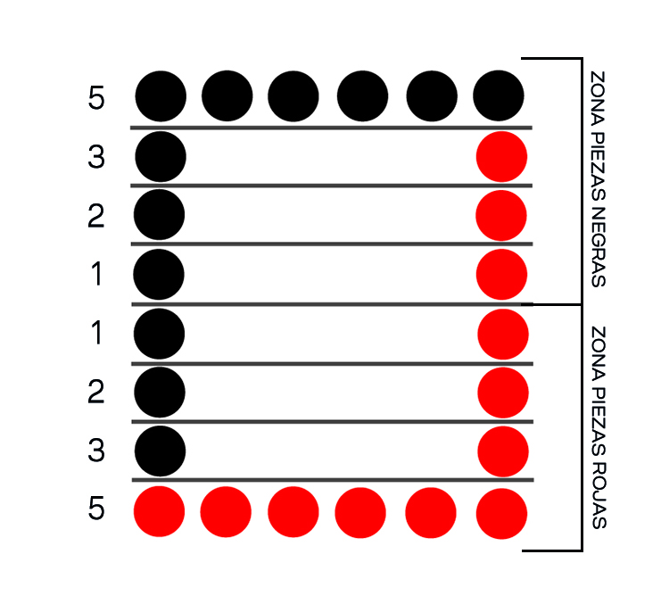
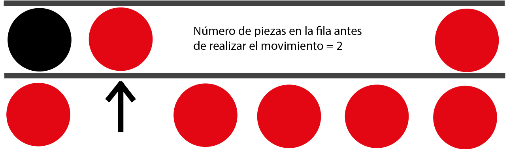

# Linja
Linja programado en Python. Linja es un juego de mesa de tipo adversario, donde un jugador juega contra otro.

## COMO JUGAR
El tablero del linja está formado por 8 filas y 6 columnas. La distribución inicial del tablero es la siguiente: 

Al igual que en cualquier juego de tipo adversario, los jugadores irán intercambiadnose el turno de forma secuencial. Cualquiera de los dos jugadores podrá comenzar la partida.

Cada turno está compuesto de 2 movimientos a excepción de algún caso que se explicará más adelante. En el primer movimiento, el jugador podrá desplazar cualquiera de sus fichas una posición hacia adelante, salvo que la fila que viene a continuación esté bloqueada por haber ya 6 fichas. En cualquier otro caso, tras haber realizado el primero movimiento, el jugador dispondrá de un segundo movimiento en el cual podrá desplazar una de sus piezas tantas posiciones como piezas hubiese en la fila a la que movió antes de iniciar el primer movimiento. Pongamos el siguiente ejemplo donde el jugador rojo avanza una de sus piezas una posición hacia delante. 

En este caso, el jugador rojo podría avanzar un total de 2 posiciones en su segundo movimiento

## REGLAS/EXCEPCIONES
Este juego ha sufrido de bastantes cambios en las reglas de juego desde su creación. Sin embargo, esta versión del linja incluse las siguientes reglas o excepciones.
-Si en el primer movimiento el jugador mueve su pieza a una fila vacía, este jugador no tendrá derecho a realizar un segundo movimiento, y por tanto su turno habrá finalizado.
## :triangular_ruler: ALGORITHMS USED
For the development of the AI used in this game, two algorithms were used. **MiniMax** and **Alpha Beta**. Both will be explained:
### :small_red_triangle::small_red_triangle_down: MINIMAX
Minimax is a very common algorithm used for adversary games where both players play against each other. It consists of two parts.
The first one is the *maximize* part, which consist in selecting the tree branch that gives the best score to the AI. On the other hand, the *minimize* part consist in choosing the branch that gives the enemy player the best score. Both selections are done based in an heuristic function.

#### :1234: HEURISTIC FUNCTION
In order to be able to evaluate if a move is good or not for one of the players, we need to evaluate the board state. In the case of Linja, we 

### :scissors: ALPHA BETA PRUNNING
